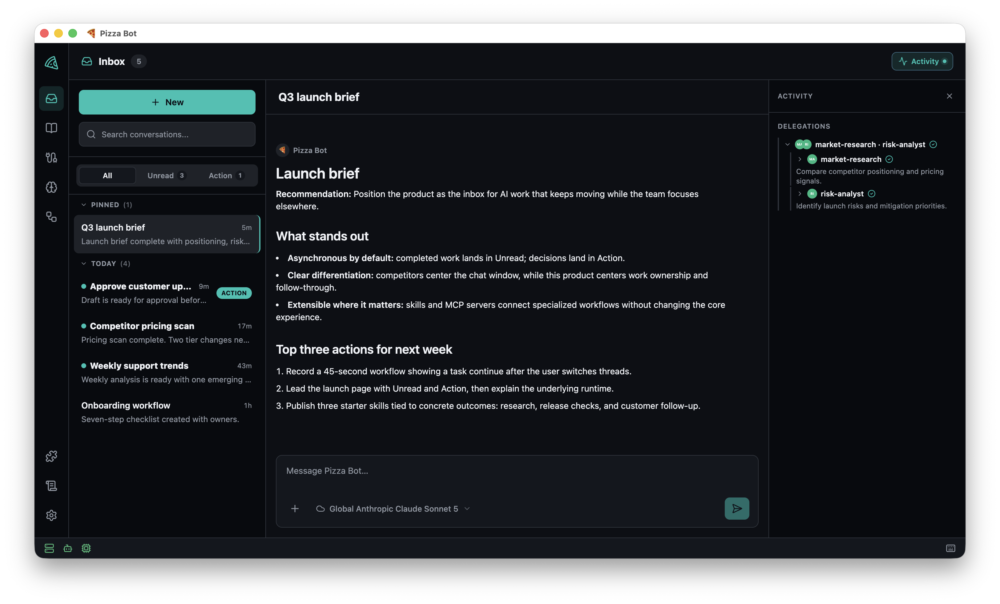

# Pizza Bot OSS

Pizza Bot is an inbox for long-running AI work. Start or schedule a task, return
to your day, and let completed work collect in **Unread** while runs waiting for
your decision collect in **Action**. Agents keep working when you navigate away
or disconnect; the api-server process must remain running.



Pizza Bot uses a stateful DeepAgents/LangGraph runtime with the same React
experience in Electron and the browser. The desktop app, web app, and terminal
CLI all communicate with the api-server over HTTP/SSE.

Pizza Bot was developed at Amazon and is released under the Apache 2.0 license.

## Why Pizza Bot?

- **Work asynchronously.** Switch conversations without stopping their runs.
- **Return to the right queue.** Completed work lands in Unread; durable approval
  requests land in Action.
- **Organize conversations.** Group threads into folders without hiding matching
  work from the global Unread and Action queues.
- **Resume real work.** Checkpointed runs survive client disconnects, and cron or
  webhook triggers can start work without an open conversation.
- **Delegate to specialists.** Skills become tool-scoped workers whose progress
  appears in the Activity panel.
- **Bring your model provider.** Amazon Bedrock, Anthropic, Google Gemini,
  OpenAI, OpenRouter, and Ollama are supported.
- **Keep control of consequential actions.** Human-in-the-loop approvals,
  long-term memory, file attachments, and desktop notifications are built into
  the workflow.
- **Grant local access explicitly.** Add individual read-only or writable folders
  under **Settings > Files**; Pizza Bot receives no default home-directory access.

## Quick start

Node.js 24 or newer is required.

```bash
npm install
npm run build
npm run dev
```

`npm run dev` starts the Vite frontend and Electron desktop shell. The shell
forks and supervises its own api-server, matching the packaged application's
process model. Configure a model under **Settings > Providers** before starting
a live run.

See [Running from source](docs/RUNNING.md) for isolated data roots, browser and
CLI development, desktop packages, and remote backends.

## Ways to run

| Experience | Best for | Start here |
| --- | --- | --- |
| Electron desktop | Local inbox with an embedded backend | `npm run dev` |
| Browser | Web development or static deployment | [Browser development](docs/RUNNING.md#browser-development) |
| Terminal CLI | Scripts, terminals, and remote backends | [CLI](docs/RUNNING.md#cli) |
| Standalone backend | Remote Electron, Docker, or Linux services | [Backend guide](docs/STANDALONE_BACKEND.md) |

A running api-server needs access to at least one model provider; HTTP clients
do not. Configure Amazon Bedrock, Anthropic, Google Gemini, OpenAI, OpenRouter,
or Ollama in **Settings > Providers**. Bedrock accepts an AWS profile, AWS
access keys, or a Bedrock API key, with an optional region override; otherwise
`AWS_REGION` or `us-west-2` is used. Bedrock combines its native catalog with
the regional Mantle catalog and routes models through Converse, OpenAI
Responses or Chat Completions, or Anthropic Messages according to their
advertised API family.
OpenAI and Anthropic also accept custom base URLs for compatible endpoints;
OpenAI can explicitly select Responses or Chat Completions, and Anthropic
supports `x-api-key` or bearer authentication. Select a model with
`PIZZA_MODEL=<provider>:<id>`. The desktop protects entered secrets with
Electron `safeStorage`; server configuration persists only environment-variable
references.

## Extend it

Add MCP servers from the UI or `<PIZZA_DATA_ROOT>/.mcp.json`. Add Agent Skills
under `<PIZZA_DATA_ROOT>/skills`, or install plugins that package MCP servers and
skills together. Skills become available after their declared tools are enabled
and connected. A custom skill can replace a Built-in or Plugin skill with the
same id without modifying the original; removing the customization reveals the
Built-in or Plugin version again. The Built-in **Pizza Bot Guide** can explain
features, suggest workflows, help with setup, and point to project documentation.

See [Extending Pizza Bot](docs/EXTENDING.md) for configuration, environment
references, skill authoring, approval gates, and plugin installation.

## Project layout

```text
apps/        api-server (Hono) | cli | desktop-shell (Electron) | web (React)
packages/    core | runtime-langgraph | inference-providers | plugin-api | plugin-sdk | storage | logging
plugins/     bundled Plugin packages and their packaging workspace
skills/      optional Built-in Agent Skills
tests/       LangGraph compatibility and protocol conformance
```

The production graph engine is isolated to `packages/runtime-langgraph`;
frontends consume protocol projections rather than importing runtime or model
bindings.

## Documentation

- **[Running](docs/RUNNING.md)** - desktop, browser, CLI, and package commands.
- **[Extending](docs/EXTENDING.md)** - MCP servers, skills, and plugins.
- **[Architecture](docs/ARCHITECTURE.md)** - system boundaries, event model,
  persistence, transports, and design decisions.
- **[Standalone backend](docs/STANDALONE_BACKEND.md)** - authentication, remote
  Electron, static browser deployment, Docker, Compose, Kubernetes, systemd, and
  Caddy.
- **[Contributing](CONTRIBUTING.md)** - development setup, CI checks, worktrees,
  releases, and layering rules.
- **[Security](SECURITY.md)** - network defaults, credentials, local data, and
  plugin trust.
- **[Logging](docs/LOGGING.md)** - diagnostics, retention, viewing, and redaction.
- **[Roadmap](ROADMAP.md)** - exploratory directions and the principles used to
  evaluate them.
- **[Code of Conduct](CODE_OF_CONDUCT.md)** - community participation
  expectations.

## Security and data

- **Local-first by default.** The api-server binds to `127.0.0.1`; non-loopback
  binding requires authentication and an explicit origin allowlist.
- **Application state stays local.** Threads, checkpoints, memories,
  attachments, and logs live under `<PIZZA_DATA_ROOT>`
  (`~/.pizza-bot-oss` by default). Model and tool requests go to the providers
  and endpoints you configure.
- **Local folders require an explicit grant.** Each folder added under
  **Settings > Files** is read-only unless you allow writes. Remote grants name
  paths on the backend host.
- **MCP servers and plugins are trusted.** Their commands and materializers can
  execute with your user account's permissions. Install only sources you trust.

See [SECURITY.md](SECURITY.md) for the complete security model and vulnerability
reporting process.

## Contributors

Pizza Bot was designed, built, and brought into the open by its Executive Chefs
and Sous Chefs:

### Executive Chefs

<a href="https://github.com/JoeDo" title="Joseph Dolivo (@JoeDo)"></a>
<a href="https://github.com/igorfil" title="Igor Fil (@igorfil)"></a>

### Sous Chefs

<a href="https://github.com/flavioschuindt" title="Flávio Schuindt (@flavioschuindt)"></a>
<a href="https://github.com/jwert-aws" title="Jacob Wert (@jwert-aws)"></a>
<a href="https://github.com/michaelkarachewski" title="Michael Karachewski (@michaelkarachewski)"></a>
<a href="https://github.com/spideron" title="Itzik Paz (@spideron)"></a>

Pizza Bot was also shaped by more than 2,000 users across Amazon who tested
earlier versions and shared feedback from real-world use. Their bug reports,
ideas, and candid input helped make Pizza Bot ready for a broader community.
Thank you to everyone who contributed.

## License

[Apache-2.0](LICENSE). See [NOTICE](NOTICE) for attribution notices.
