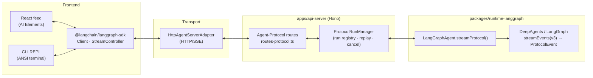

# Architecture — Pizza Bot OSS

> One stateful Pizza Bot running on DeepAgents / LangGraph, locally, inside an
> Electron app, or against a remote server.

This document describes the system as it is. It is the source of truth for
package boundaries and interface contracts. When an external library's shape
matters (DeepAgents or native LangGraph protocol events), a conformance test
pins it (§12) — so an upstream change breaks a test, not production. The
AI Elements-derived components are vendored UI code rather than a conformance
target.

---

## 1. Overview

The spine is a nearly-pure core package plus a set of composition-root apps:

- `packages/core` is nearly pure (no `node:*`, no DOM, no `deepagents` /
  `@langchain/langgraph`) but MAY reference `@langchain/core` model/agent TYPES
  (`BaseChatModel`) — the app is coupled to LangGraph by design, so the model seam
  is typed rather than laundered through `unknown` (§11). Core also owns the pure
  protocol/wire types (`protocol-types.ts` — the normalized message/state shapes,
  the HITL vocabulary, the error taxonomy, and `PROTOCOL_VERSION`).
  The framework-agnostic message/thread-slice projection helpers live in
  `apps/web/src/projection`, beside their only consumer. Together they define the
  data contract and the seams.
- Platform-bound storage, model builders, and transports are assembled at
  composition roots. The api-server owns the sole runtime and durable stores;
  clients reach it over HTTP/SSE.

```
apps/        api-server (Hono) · cli · desktop-shell (Electron) · web (React)
packages/    core · runtime-langgraph · inference-providers
             · plugin-api · plugin-sdk · storage · logging
plugins/     shipped plugin bundles and their packaging workspace
skills/      SKILL.md capabilities the orchestrator equips + delegates to
tests/       langgraph-compat
```

**Dependency guardrails:** `core` imports no runtime graph engine (`deepagents` /
`@langchain/langgraph`), only `@langchain/core` model/agent TYPES.
`runtime-langgraph` is the only production package that imports `deepagents` and
constructs runtime graphs — if DeepAgents' API churns, the runtime blast radius
is one package. The `tests/langgraph-compat` workspace imports DeepAgents only to
pin its public exports. In production, storage may import LangGraph
checkpoint/store primitives and the api-server may import protocol event types;
the conformance workspace may import upstream types for tests. `apps/web` imports
no graph runtime and no model binding; it speaks the pure `core` types, transport
SDK projections, and AI Elements shapes. The frontend MAY import the transport SDK
(`@langchain/langgraph-sdk`) but never the graph engine. An eslint layering rule
enforces this split.

The transport-agnostic message/thread projection helpers live in
`apps/web/src/projection` (their only consumer), not in a shared package.

The end-to-end path, from a frontend keystroke down to the graph:



---

## 2. The transport seam

The load-bearing seam is the **protocol + SDK projection** boundary: every client
drives the agent through the `@langchain/langgraph-sdk`
`Client`/`ThreadStream`/`StreamController` over HTTP/SSE. The SDK decodes the
runtime's native `@langchain/protocol` frames into its own projections; clients
render those projections through a headless `StreamController`, keeping React
code outside the transport boundary. The api-server assembles the concrete
LangGraph runtime through `createPizzaBotAgent`.

The production transport is **HTTP** (the SDK's `HttpAgentServerAdapter`), which
talks to `api-server`'s Agent-Protocol routes (§6). Every client — web, desktop,
and the terminal CLI — uses it to reach a running server.

The server caps ordinary JSON request bodies at 1 MiB before route parsing.
Skill create/update requests allow the 50 MiB uncompressed skill limit after
base64 expansion, plus 1 MiB for JSON metadata (about 67.7 MiB). Multipart
attachment, skill, and plugin uploads have separate limits based on their
supported artifact sizes.

`InProcessTransport` exists only under `apps/api-server/src/test-utils` as a
protocol assembly test harness; it is not a deployment mode.

**Runtime assembly.**
`runtime-langgraph` exports `createPizzaBotAgent(systemPrompt, deps):
Promise<LangGraphAgent>`; the returned agent structurally satisfies core's minimal
`AgentHandle` (`core/src/agent-run.ts`) — the state read/write methods (`getState`
/ `getStateHistory` / `updateState`). The streaming method `streamProtocol` is
on the concrete `LangGraphAgent` because its `ProtocolEvent`s require a
`@langchain/langgraph` type. This keeps pure `core` free of a `deepagents`
import. The factory also enforces HITL's checkpointer requirement.

Background runs outlive the request that started them via the host's
`ProtocolRunManager`: a consumer starts a run, may drop the SSE connection, and
reconnects with `since` to replay the gap then live-tail — see §6 and §9.

---

## 3. The native protocol stream

The runtime streams via LangGraph's `streamEvents(v3)` and yields raw
`@langchain/protocol` `ProtocolEvent` frames — the wire the
`@langchain/langgraph-sdk` transport + `StreamController` were built to decode.
`runtime-langgraph`'s `streamProtocolEvents` (`stream-protocol.ts`) is a linear
pump, and all run-scoped correlation (tool-call ↔ result and subagent
namespacing) is either native to the v3 stream or reassembled client-side by the
SDK.

The projection helpers map the SDK's decoded message projections **out** to AI
Elements `UIMessage.parts` (`messagesToUI` / `overlayInterrupt` in
`apps/web/src/projection/messages.ts`; `ThreadSlice`/`StreamStatus` in
`thread-slice.ts`). The frontend never imports the graph runtime or a model
binding, and embedded and remote backends render through the same HTTP/SSE path.

The **pure data contract** the platform reads off checkpoints and the wire lives
in `core/src/protocol-types.ts`:

- `NormalizedMessage` / `MessagePart` — the message shape the projection helpers
  target, decoupled from any single SDK's message class.
- `ThreadStateValues` — the typed `ThreadState.values` (checkpoint transcript plus
  an index signature for middleware-owned channels), so readers get
  `values.messages` without an inline cast; the runtime→normalized and wire→client
  boundaries are the only places that adopt the opaque shape.
- `HitlDecision`/`InterruptPayload`/`ResumeCommand` — the HITL vocabulary.
- `ErrorCode`/`ERROR_CODES` — the machine-readable error taxonomy
  (`AUTH_EXPIRED`/`TIMEOUT`/`RATE_LIMIT`/`CONTEXT_LENGTH`/…) so the UI can pick a
  recovery affordance.
- `PROTOCOL_VERSION` — one source of truth the api-server advertises on `GET /`
  (as `protocolVersion`) so a client can detect an incompatible server before a
  decode error.

---

## 4. The runtime (DeepAgents / LangGraph)

`runtime-langgraph` builds a DeepAgent via `createDeepAgent`:

- **Middleware stack** over LangChain's `createAgent`: DeepAgents supplies
  filesystem, subagents, summarization, and prompt caching. Pizza Bot adds tool
  error recovery, attachment inlining, sandboxed evaluation, memory, a transient
  host-local date/time prompt refreshed for every model call, and — when
  `interruptOn` is set — `HumanInTheLoopMiddleware`. The clock context is also
  attached to skill workers and is never checkpointed. Task planning middleware
  is intentionally excluded, including from model-specific harness profiles.
- **Runaway-call limits** are per agent invocation, with no combined parent/child
  budget. The orchestrator allows 20 model calls and 40 tool calls; each
  `task`-invoked skill worker independently allows 20 model calls and 80 tool
  calls. A worker's last model call is tool-free and reserved for returning
  verified results with an incomplete-coverage disclaimer when necessary. A
  delegation counts as one orchestrator tool call, while the worker's calls count
  only against that worker. Parallel calls are counted individually.
- **Checkpointer** and **store** are passed *into* `createDeepAgent` (never set
  post-hoc). Checkpointer = short-term, thread-scoped; store = long-term,
  cross-thread.
- **Filesystem backend** is a `CompositeBackend`: checkpoint-scoped files remain
  in `StateBackend`, durable memory is routed to `/memories/`, and explicit
  backend-host folder grants are routed beneath `/local/<id>/`. Grants default
  to read-only and may explicitly allow writes. Overlapping grants are additive,
  so the API permits only a read-only ancestor with a writable descendant;
  same-access overlaps and read-only descendants beneath writable roots are
  rejected as redundant or misleading. Granted roots use
  `FilesystemBackend({ virtualMode: true })` plus canonical path and mutation
  parent checks that reject traversal and symlink/junction escapes. The backend
  reads the SQLite grant registry for every operation, so removal revokes access
  from already-compiled graphs. Local-folder tool results percent-encode
  non-ASCII and path-sensitive filename bytes into an ASCII-safe virtual path;
  the backend reverses that encoding before using the granted filesystem root.
  Read-only lookups may recover a uniquely NFKC-equivalent on-disk path when a
  model changes a compatibility character; mutations always require the exact
  virtual path. Grants that overlap the application data root require explicit
  acknowledgement because they can expose or modify private application state.
  Standalone directory browsing is a separate, operator-configured capability:
  the API lists directories only beneath canonical
  `PIZZA_LOCAL_FOLDER_BROWSE_ROOTS` and never follows symlinks while browsing.
- **Model context limits** are resolved by each inference-provider adapter from
  effective local configuration or provider metadata, with models.dev filling
  missing catalog fields. The adapter publishes the same available limit as
  `ModelDescriptor.contextWindow` for clients and
  `model.profile.maxInputTokens` for DeepAgents summarization. Native LangChain
  profiles remain the fallback when catalog metadata is unavailable.
- **HITL**: a skill declares `interruptOn: { toolRef: { allowedDecisions } }`.
  On an interrupt the runtime surfaces the pause as a native protocol interrupt
  frame; the UI renders the AI Elements-derived `Confirmation` component; the
  client sends the decision back over the SDK as an `input.respond` command →
  a `ResumeCommand` → `Command({ resume })`. Because a node re-runs from the
  top on resume, pre-interrupt tool side effects must be idempotent.
- **Skill workers**: there is one selectable identity, the built-in **Pizza Bot**.
  DeepAgents' synchronous `general-purpose` worker and `task` tool remain
  available by default, including when no skills are installed. The root
  QuickJS interpreter also exposes `task()` for programmatic fan-out.
  Each skill catalog entry compiles directly into one worker invoked through the
  `task` tool. Its `SKILL.md` body is the system prompt, its description is the
  routing signal, and its declared `mcp:server:tool` refs are its complete tool
  surface. A readiness projection compiles the worker only after every explicit
  tool exists, every wildcard has completed discovery with a match, and every
  built-in dependency is available. Dependency-free skills are ready
  immediately. Loading or unavailable skills are omitted from the callable
  subagent list and summarized in the root prompt. Workers share the selected
  conversation model and each receive only their own skill bundle. Synchronous
  worker graphs do not contain subagent middleware, so only Pizza Bot can delegate.

---

## 5. Persistence

Two systems, injected as `RuntimeDeps` (`packages/storage`):

- **Checkpointer** — `SqliteSaver` → `checkpoints.sqlite` (threads, HITL,
  time-travel). This is LangGraph's contract; leave its schema to it.
- **Store** — `SqliteStore extends BaseStore` → `store.sqlite` (cross-thread
  long-term memory; durable analog to the in-memory store).

Everything the platform itself owns — thread metadata, user-defined thread
folders, triggers, terminal run activity, capability enablement preferences, the
FTS message index, and attachment metadata — lives in one
`app.sqlite`, opened once via `openAppDatabase()`: a **single**
`better-sqlite3` handle (one WAL lock) shared by the stores, rather than one
handle per store on the same file. The data-root layout
(`storage/src/layout.ts`) maps a root path to these files; a `:memory:` root
keeps everything in-process for tests, and because the stores share the one
handle they coexist in that single in-memory db.

### File attachments — stored by reference, inlined at the model call

A user can attach files (images + Bedrock-supported documents) via the composer's
`+` button, drag-and-drop, or paste. The design keeps bytes **out of the
checkpoint**, because `SqliteSaver` re-serializes the entire message state on every
write (and encodes raw bytes as a bloated int-array), so a multi-MB base64 blob in
message content would inflate every checkpoint and every replay/reconnect.

The flow (one file stored once, referenced everywhere):

1. **Upload** — `POST /attachments` (multipart) writes the blob to
   `attachments/<id>` on disk and a metadata row to `app.sqlite` (`AttachmentStore`,
   `packages/storage`). It returns an `attachment://<id>` reference URL.
2. **Message** — the composer embeds that reference in the message's `file`
   `MessagePart`. What lands in the durable checkpoint is only the lightweight
   `{type:"file", url:"attachment://<id>", …}` reference block — never the bytes.
3. **Model call** — a `wrapModelCall` middleware (`attachment-inline-middleware.ts`,
   `runtime-langgraph`) resolves each reference to base64 bytes via an injected
   `RuntimeDeps.attachmentResolver` (backed by the `AttachmentStore`) and rewrites it
   into the `source_type:"base64"` content block — the only shape `@langchain/aws`
   converts for images/documents on Bedrock, and LangChain's cross-provider lingua
   franca. This runs per-call and never mutates checkpoint state.
4. **Render** — `GET /attachments/:id` streams the blob for the feed's image
   thumbnail / document link (`resolveAttachmentSrc` maps `attachment://` → the
   route). `messagesToUI` surfaces the reference blocks as file parts on hydration.

The MIME allow-set + size cap + the `attachment://` scheme are the pure, shared
facts in `core/src/attachment.ts`, so the composer's `accept`, the upload route's
validation, and the inliner's image-vs-document branch can't drift. Acceptance is
by resolved type, not the raw browser MIME: `resolveAttachmentMediaType` keeps a
valid browser type, else infers from the filename extension (a `.json`/`.yaml`/
`.log`/source file the OS labels empty or `application/octet-stream` still works),
normalizing text/source/config extensions to `text/plain` — the format Bedrock's
DocumentBlock takes — while preserving the original filename for display. Size
limits are provider-associated (`AttachmentLimits`, category-aware image vs
document ceilings declared per provider — `BEDROCK_ATTACHMENT_LIMITS` is the only
one wired today) enforced on top of the absolute `MAX_ATTACHMENT_BYTES` transport
cap, so a future provider adapter declares its own without touching the store.

---

## 6. Transports and the run registry

`apps/api-server` (Hono) is the remote harness. Its streaming surface is the
**Agent-Protocol** wire the `@langchain/langgraph-sdk` transport speaks
(`routes-protocol.ts`), four thread-centric endpoints:

- `POST /threads/:id/commands` — a `ProtocolCommand` (JSON). `run.start` returns
  a success envelope with `result.run_id` synchronously (or the SDK deadlocks
  waiting to open its SSE); `input.respond` resumes a HITL interrupt; `run.stop`
  cancels; `state.get` returns checkpointed state.
- `POST /threads/:id/runs/:run_id/cancel` — the REST cancellation route the SDK's
  `stop()` calls in preference to the `run.stop` command. Cancellation is matched
  on `runId` so a late abort cannot kill a replacement run on the same thread.
- `POST /threads/:id/stream/events` — the SSE event stream. Each frame carries a
  `data:` payload with `seq` plus `event_id`, and an SSE `id:` set to that
  sequence number; Hono determines their emission order. Body carries
  `{channels, namespaces?, depth?, since?}`; it replays buffered frames with
  `seq > since` and then tails live. Comment heartbeats activate the SDK's idle
  watchdog so a half-open connection is re-established.
- `GET /threads/:id/state` — checkpointed thread state for hydration.

`routes-langgraph.ts` also exposes the checkpoint-shaped subset Pizza Bot needs:
`POST /threads`, a state update, and `GET`/`POST` history queries (the state read
is the `GET` above). `routes-threads.ts` adds `GET /threads/events`, the SSE
ready/heartbeat/changed stream that refreshes the inbox, plus
`GET /threads/activity/events`, a cursor-based stream of durable terminal run
outcomes used by desktop notifications. This is not the LangGraph Agent Server
API: assistants, standard runs, stores, and crons are absent, and standard
Agent Server clients are not a compatibility target. Platform routes provide
thread list/search/fork/PATCH/DELETE behavior plus folder CRUD, and `GET /ping`
is the desktop-sidecar health probe.

**`ProtocolRunManager`** (`protocol-run-manager.ts`) is the in-process run
registry: it tracks the current run for each thread, assigns each generation a
`runId`, buffers `ProtocolEvent` frames per run, fans out to multiple observers
with `since`-based **replay**, and cancels via `AbortSignal`. This is what makes
a run outlive the request that started it — a client can start a background run,
drop the connection, and re-attach with `since` to get the buffered gap then
live tail. Its `onEnd(...)` hook is where run-end side effects (§7, §10)
subscribe.

---

## 7. Triggers

`packages/core/src/trigger.ts` defines `TriggerDef` (cron | webhook); the
`TriggerService` in `api-server` is the single scheduler owner — the API server
process arms them, with no cross-process lease. Every trigger fires a run through a
`RunLauncher` backed by the `ProtocolRunManager` (`protocol-run-launcher.ts`) and
is tracked by a durable `trigger_occurrences` row (pending → running →
succeeded/failed/dead). On startup the service runs two recovery passes: cron
triggers get **missed-run recovery** (if a schedule interval elapsed while the
process was down, the run fires once to catch up), and any occurrence left
`pending`/`running` by a crash is replayed once, bounded by a per-occurrence
attempt budget. The Electron shell pauses cron timers before system sleep. On
resume the host reconnects MCP servers first, rebuilds schedules, and performs
one missed-cron recovery. It deliberately does not replay an in-flight
occurrence on wake because its tool side effects may already have happened;
crash recovery remains the startup-only path. Initial startup similarly waits
for the bounded MCP connection pass to settle before arming schedules or
recovering occurrences, so recovered runs receive the settled skill projection.

---

## 8. Plugins

A plugin declares its browser-safe contract through `packages/plugin-api`;
the Node-bound loader and host live in `packages/plugin-sdk`. Plugins contribute
declarative resource types,
using a supported subset of the Claude Code plugin format:

- **MCP servers** — connected via `@langchain/mcp-adapters`
  (`MultiServerMCPClient`, stdio/http/sse); their tools convert to LangChain tools
  that DeepAgents consumes directly. The subprocess/transport/tool-conversion work
  is the adapter's; the platform's layer is manifest parsing and wildcard tool
  resolution (`mcp:server:*`). Connections start with bounded concurrency and
  publish successful discovery snapshots incrementally. Snapshots rebuild
  the static graph only when the skill readiness projection changes; in-flight turns keep
  their graph while subsequent turns see the replacement. A server entry can set
  `enabled: false` to remain configured without launching. String fields expand two kinds of
  placeholder at load time: `${CLAUDE_PLUGIN_ROOT}`/`${PLUGIN_ROOT}` (the plugin's
  on-disk dir) and `${ENV_VAR}` from the environment (Claude Code's `.mcp.json`
  convention) — so a secret like a bearer token stays out of the committed
  manifest (e.g. a plugin `.mcp.json` header reading `${SOME_API_KEY}`).
- **Skills** — `SKILL.md` bundles are the only extension point for delegation.
  `loadPlugins` reads each plugin-shipped skill dir into a `SkillCatalog`
  (`@pizza-bot/core`), and the runtime turns the complete catalog into isolated
  workers. Each worker receives its `SKILL.md` body directly as its system prompt
  and its description becomes root routing metadata in the `task` tool. The root
  does not receive DeepAgents' skills middleware, so it delegates from that
  metadata without reading the skill body first. The runtime still seeds every
  equipped skill's files into the run's state `files` as FileDataV2 (UTF-8 strings
  or binary `Uint8Array` plus MIME type), preserving sibling assets in the shared
  backend. `FilesystemBackend` is deliberately not used for this (it walks the
  real disk unsandboxed). The editor equips skills via a picker beside Tools;
  `GET /skills` is the catalog. **Three sources** feed one catalog: built-in
  skills under the repo/package `skills/` directory (`loadBuiltinSkills`),
  plugin-shipped skills (`loadSkillCatalog`), and **user-authored** skills under
  `<data-root>/skills` (`loadUserSkills`), merged with the user winning on an id
  collision. User skills are editable via `POST/PATCH/DELETE /skills` →
  `host.reloadSkills()` (live on response, no restart); editing a built-in or
  plugin-provided skill creates a user override, and deleting that override
  reveals the original source again.

Capability enablement is an installation-owned overlay in `app.sqlite`, keyed
by resource kind, source identity, and id. It applies uniformly to user,
built-in, and plugin contributions without mutating shipped files. Disabled
skills are filtered before readiness projection, unavailable-skill prompting,
worker compilation, and state seeding. Explicit enable requests require every
declared MCP server to exist and be enabled, and a server cannot be disabled or
deleted while an enabled skill depends on it. External configuration absence,
loading, and connection health affect readiness without changing saved
enablement intent, so an enabled skill can be temporarily unavailable and
recovers when its dependencies return.

Plugins contribute skills and MCP servers only — there is no web-UI contribution
kind. A plugin may declare the namespaced
`extensions["dev.pizzabot.materializer"]` lifecycle hook to generate those same
declarative resources from local source roots. The host runs its root-confined
entrypoint with `process.execPath` on install, startup, or manual refresh, as
selected by the manifest. It validates the generated plugin tree before
atomically activating a versioned snapshot under
`<data-root>/plugin-materializations`; a failed later run retains the last good
snapshot and reports stale status. There is no source watcher.

`GET /plugins` (`routes-plugins.ts`) reports every discovered plugin, including
its loaded, disabled, incompatible, or failed status and diagnostic detail.
Loaded entries also report manifest metadata, skill + MCP-server counts, and
materialization status. Unsupported manifest fields (`commands`, the
`pizzaBot.ui` slot/tool-view block) are parsed and dropped rather than rejected,
so a Claude Code plugin that carries them still loads.

**Security boundary:** plugin-shipped skills may not declare `hooks`,
`mcpServers`, or `permissionMode` (mirrors the Claude Code rule). Configured
stdio MCP commands and materializer entrypoints are arbitrary executables
launched as child processes with the user's permissions. Materializers inherit
the host environment; MCP processes receive an explicit environment allowlist.

---

## 9. Frontend

`apps/web` is Vite + React. Rendering runs off the SDK's own projections: the
module-level **`ProtocolStreamStore`** (`protocol-stream-store.ts`, keyed by
`threadId`) holds one headless `@langchain/langgraph-sdk` `StreamController` per
thread and maps its decoded message projections into per-thread `ThreadSlice`s via
the pure projection helpers (`messagesToUI`, `thread-slice.ts` in
`apps/web/src/projection`). The store carries no runtime-graph dependency — only
the transport SDK and the pure `core` types (enforced by the eslint frontend
layering guard). React binds to it from
the OUTSIDE via a thin `useSyncExternalStore` hook (`use-thread-slice.ts`);
`ChatFeed` renders through vendored AI Elements components. HITL and reasoning
map to AI Elements' `Confirmation` and `Reasoning`; source parts render as
linked source annotations. The
Activity panel renders observed subagent delegations and transcript drill-downs,
not model-maintained progress state.

The inbox sidebar treats `All`, `Unread`, and `Action` as global smart views.
User folders are an orthogonal, single-folder organization layer over thread
metadata; deleting a folder moves its threads to `Inbox`. The filter control
shows or hides the folder panel and resets the active view to `All` when hidden,
so a folder scope is never applied without a visible explanation.

**Concurrent streams, only while active.** Several threads can stream at once, but
an idle thread holds no live connection. Each thread's `StreamController` lives in
the store (outside React), not in a mounted React component kept alive with
`display:none` — so switching away doesn't drop it and only the active pane
renders. A run survives a reconnect via the manager's `since`-based replay (§6).
The "running dot" in the sidebar is local-only (the threads this tab is
streaming): there is no server-side run-listing route to poll.

The Electron main process follows the durable thread-activity stream at app
scope, independently of BrowserWindow lifetime. Its initial cursor is a silent
baseline; later successes, errors, timeouts, and interrupted runs map directly
to native notifications, while explicit cancellation stays silent. Preload
exposes device-local preferences and buffers click navigation until React is
ready; browser builds omit the controls. App-level SSE readers enforce an idle
deadline longer than the server heartbeat cadence so sidebar and notification
subscriptions recover after sleep or a half-open remote connection.

---

## 10. Apps (composition roots)

- **api-server** — the Hono remote harness (§6). `AgentHost` composes durable
  persistence + model + agent def into a `LangGraphAgent` via
  `createPizzaBotAgent`; every graph is checkpointer-backed. It holds no
  business logic: the durable run-end side effects (FTS reindex, sidebar
  refresh, LLM title generation, per-message agent attribution) live in
  `@pizza-bot/storage`'s `RunMaintenance` next to the stores they mutate, behind an
  injected-deps seam (so storage imports no model provider / runtime SDK); the
  host just wires `RunMaintenance.onRunEnd` to the `ProtocolRunManager.onEnd` hook.
  It also owns the trigger scheduler (§7).
- **desktop-shell** — Electron; supervises the api-server as a forked sidecar
  (port negotiation, bounded health checks, backoff, graceful shutdown) and
  renders `apps/web`. It owns native notifications and device-local
  notification preferences, and keeps the notification activity stream alive
  without a renderer window. `powerMonitor` coordinates suspend/resume with
  the embedded host; an unhealthy child is restarted, while a healthy child
  reconnects MCP before recovering schedules. Keychain secret changes reach the
  existing sidecar over private parent/child IPC, so provider edits do not
  restart the host or unrelated MCP servers. The shell also owns the native
  directory picker and exposes it only while the embedded backend is active;
  remote folder paths belong to the backend host. The shared web UI falls back
  to the backend's restricted directory browser when one is configured.
- **cli** — a thin REPL driving the SDK `Client`/`ThreadStream` over HTTP against
  a running server (`PIZZA_REMOTE_URL`, default `http://localhost:8080`;
  `PIZZA_API_TOKEN` for bearer auth). It boots no runtime of its own — the same
  `renderProtocolTurn` renders the server's protocol stream.

---

## 11. Design decisions

### Runtime and protocol boundary

Every agent is **stateful**: checkpointer-backed, resumable, time-travelable. The
runtime is DeepAgents/LangGraph, assembled by the api-server through the
`createPizzaBotAgent` factory:

- The concrete `LangGraphAgent` structurally satisfies core's minimal
  `AgentHandle` (state read/write). Pure `core` imports no `deepagents` /
  `@langchain/langgraph`; it *may* reference `@langchain/core` model/agent TYPES
  (`BaseChatModel`), so the model seam remains typed.
- `LangGraphAgent.streamProtocol()` emits native `@langchain/protocol` frames,
  and the SDK owns tool-call correlation, subagent namespacing, message-part
  merging, and reconnect replay.
- The factory validates that skills requiring HITL receive a checkpointer.

The externally shared seam is the **transport + SDK projection** boundary:
frontends import neither the runtime graph engine nor model bindings and render
decoded SDK projections rather than raw LangGraph internals.

### Why the protocol is not the LangGraph Agent Server API

The `api-server` intentionally owns a smaller, thread-centric protocol. The
standard Agent Server surface includes broader assistant, run, store, and cron
contracts plus deployment infrastructure that this local-first application does
not need. Pizza Bot instead requires a lightweight Node process that can run
inside an Electron sidecar while preserving background runs and reconnect
replay. A separately deployed service with supporting persistence and pub-sub
infrastructure cannot provide that embedded desktop process model.

The api-server, `ProtocolRunManager`, and trigger service provide that narrower
host. Pizza Bot reuses native LangGraph `ProtocolEvent` frames and
checkpoint-shaped state values, but does not claim Agent Server route or
standard-client compatibility.

### External plugin contributions are declarative

A plugin contributes two declarative resource kinds — MCP servers and skills —
using a supported subset of the Claude Code plugin format. An optional trusted
materializer can produce those resources before they are loaded, but there is no
executable-web-UI contribution kind; the manifest ignores unsupported fields
rather than failing (§8).

### Model provider adapters

The model seam (`core/model-provider.ts`) is provider-agnostic: `ModelProvider`
(`listModels` + `buildModel(modelId) → BaseChatModel`), and a `ModelRegistry` keyed by
the `provider:model` prefix. The composition root registers
providers (`agent-host.ts` registers them through `registerBuiltinProviders`) and
each turn carries its model as `configurable.model`. Amazon Bedrock, Anthropic,
Google Gemini, OpenAI, OpenRouter, and Ollama are peer `ModelProvider` adapters;
another provider can follow the same pattern without changing the runtime,
transport, or frontend. Each adapter is a peer submodule under
`packages/inference-providers/src/providers/<id>` (Bedrock keeps its own
subdirectory for the shim's multiple files). Provider quirks stay
provider-local: the Bedrock adapter
(`packages/inference-providers/src/providers/bedrock`) owns the `maxTokens`
default
(8192, so Sonnet-5 adaptive thinking can't blank a turn) and a temporary
reasoning-replay shim. It also combines native Bedrock discovery with Mantle's
regional `/v1/models` catalog and records the protocol supplied by each source:
inference profiles and other native models use Converse, raw OpenAI model
families, xAI, and Gemma 4 use Responses, raw Anthropic model families use
Messages, and other Mantle model families use Chat Completions. Mantle catalog
entries retain the protocol family exposed by that catalog. The regional Mantle
host and protocol paths are Bedrock concerns, and its HTTP transport supports
both Bedrock API keys and SigV4 credentials. The OpenAI adapter
independently selects Automatic, Responses, or Chat Completions for custom
compatible endpoints. The Anthropic adapter likewise owns custom Messages API
endpoints and `x-api-key` versus bearer authentication. OpenAI-compatible
Responses models receive native `input_image` blocks because the upstream
converter otherwise emits Chat Completions image content inside the Responses
payload.
The Ollama adapter reads daemon capabilities per model. For vision models it
projects tool-returned images into Ollama's supported user-image representation;
for other models it replaces the binary payload with a capability notice.

A provider that fans out to several catalog APIs reports a lost source instead of
a quietly shorter list. The Bedrock adapter logs every rejected source, keeps a
per-source last-good list so one flaky API cannot shrink the session's catalog,
and publishes `catalogDegradation(models)` keyed on the listing it describes, so
overlapping listings cannot cross-report each other's gaps; the registry turns
that into `ModelCatalogStatus` `degraded` and — unlike a `ready` listing — never
adopts a partial result as the last-good baseline. Automatic default selection
goes through `automaticModelCatalog`, and an incomplete or empty catalog keeps
the remembered pick (`automatic_model` in `app_defaults`) at the head of the
candidate list rather than re-resolving, so a degraded warm-up cannot re-point
scheduled automations at a different model. Most installations leave providers
unconfigured, so one listing nothing is normal — but the remembered pick's own
provider is stricter: only a ready listing, or an unconfigured one that voids the
pick outright, may resolve a different default, since a failed listing may simply
be hiding the remembered model.

Skill workers mark terminal responses whose provider metadata reports an
output-token limit with an `OUTPUT_TRUNCATED` notice. DeepAgents carries that
notice in the task result so Pizza Bot can distinguish incomplete delegated work
from a completed result. The worker does not retry the model call, and this
behavior is not installed on Pizza Bot itself.

The Bedrock Converse shim subclasses `ChatBedrockConverse` and strips prior
reasoning blocks only at its three model-call entry points. This is intentionally below
DeepAgents: Pizza Bot and all skill workers use ordinary initialized LangChain
model instances, with no replacement subgraphs. The shim is
necessary because `@langchain/aws` currently discards Bedrock reasoning signatures
on the native `streamEvents(v3)` path; `outputVersion: "v0"` fixes `.invoke()` but
not that path. Its limitations are explicit:

- reasoning remains in checkpoints for display but is not sent back to Bedrock,
  so the model cannot continue hidden reasoning from a prior turn;
- the adapter overrides protected LangChain methods (`_generate`,
  `_streamResponseChunks`, `_streamChatModelEvents`), so provider upgrades must
  typecheck and exercise all three paths;
- remove the subclass and `stripReasoningForBedrock` once native-v3 conversion
  preserves and replays signatures correctly (track langchainjs#11164/#11246).

A provider-configuration UI ships in Settings (`ProvidersSettings.tsx`): a
declarative auth-field schema per provider renders a generic config form, and
secrets pass through the desktop shell's `safeStorage` bridge and are never sent
back to the browser after storage. On Linux, `safeStorage` can fall back to
`basic_text` when no compatible secret store is available; see
[Security](../SECURITY.md). The desktop main process updates the embedded
sidecar's environment over its private child-process IPC channel.

---

## 12. Staying current — the conformance suite

`tests/langgraph-compat` pins the **DeepAgents** exports and native LangGraph
protocol-event shapes the product actually consumes. It does not compare routes
with Agent Server because that API is not implemented or claimed.

Its strongest layer is **live protocol-stream-shape conformance**
(`protocol-stream-conformance.test.ts`): it drives the real production path —
`createPizzaBotAgent().streamProtocol()`, i.e. real `createDeepAgent` →
`streamEvents(v3)` — against a scripted, deterministic chat model, entirely
offline. It pins the invariants the SDK `StreamController` hard-depends on: (1)
each yield is a `ProtocolEvent` envelope (`{type,seq,method,params}`), not a
`[ns,mode,chunk]` tuple; (2) a plain text turn's `messages` `text-delta`s
reconstruct the assistant text and a ROOT-namespace terminal `lifecycle:completed`
frame fires so the run promise settles; (3) the orchestrator's model tokens ride a
NON-EMPTY `["model_request:<uuid>"]` namespace (the subagent-projection
discriminator); and (4) a Command-returning `write_file` call surfaces natively
on BOTH the `tools` channel (started→finished lifecycle) AND `values` (`files`). A
DeepAgents bump that reshapes the v3 stream fails here, not in prod. It also pins
two error-path intents: a thrown model error → root `lifecycle:failed` carrying
the `classifyError` code, and a throwing tool RECOVERING to success (not a fatal
abort).
