# Connect Pizza Bot to Gmail and Google Calendar

This guide walks through giving Pizza Bot access to your Gmail and Google Calendar using the `google-workspace` plugin. The plugin is a local MCP server built on Google's official Node clients. It stores its credentials in your operating system's keychain, so nothing sensitive is written to a config file.

**What you get**

| Area | Tools | Notes |
|---|---|---|
| Gmail | `search_threads`, `get_thread`, `list_labels`, `create_draft` | Reads mail and creates drafts. There is no send, delete, or modify tool. |
| Calendar | `list_calendars`, `list_events`, `get_event`, `find_free_time`, `create_event` | `create_event` does not email attendees unless `sendUpdates: "all"` is passed. |

Two skills sit on top of the tools: `email` and `calendar`. Both treat message and event text as untrusted input.

**Time required:** about 15 minutes, almost all of it in the Google Cloud Console.

---

## Overview

1. Create a Google Cloud project.
2. Enable the Gmail API and the Google Calendar API.
3. Configure the OAuth consent screen and declare the four scopes.
4. Add yourself as a test user.
5. Create a **Desktop app** OAuth client and download its JSON.
6. Run the plugin's consent flow, which stores a refresh token in your keychain.
7. Reconnect the plugin in Pizza Bot and verify.
8. Optional but recommended: publish the app to production, so the token does not expire weekly.

Console URLs below use `<PROJECT_ID>` as a placeholder. Substitute your own project ID.

---

## 1. Create a Google Cloud project

Open <https://console.cloud.google.com/projectcreate>.

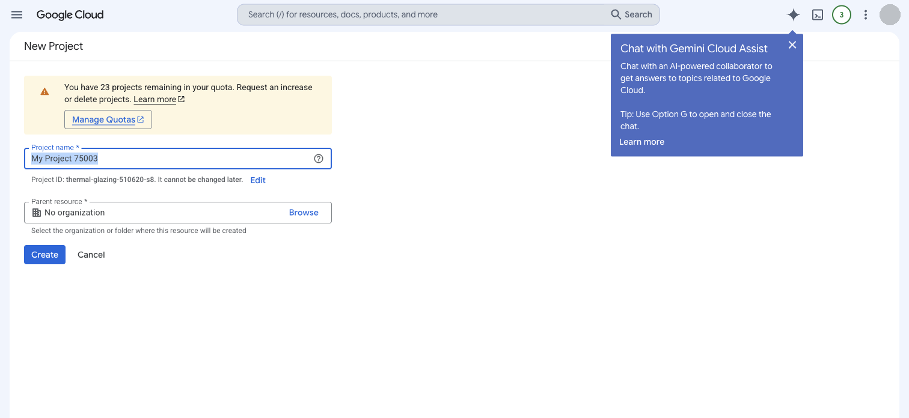

Name the project **Pizza Bot**. The project ID is generated from the name, so it changes as you type. Note the final ID, because you cannot change it later.

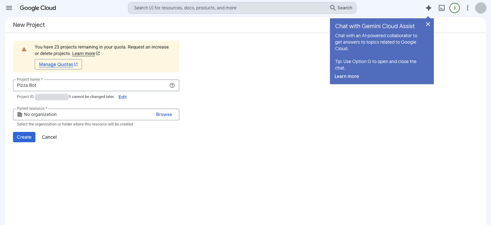

Click **Create**. Project creation continues in the background, and the console may send you back to a previously selected project. Don't click Create a second time. Check the project picker or <https://console.cloud.google.com/cloud-resource-manager> to find the new project, and make sure it is selected before continuing.

---

## 2. Enable the Gmail and Calendar APIs

Open the Gmail API page for your project:
`https://console.cloud.google.com/apis/library/gmail.googleapis.com?project=<PROJECT_ID>`

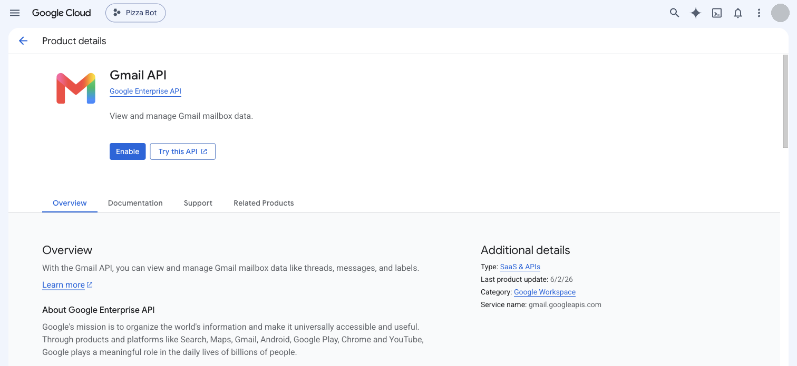

Click **Enable**. After a few seconds the console redirects to the API's details page, which shows **Status: Enabled**.

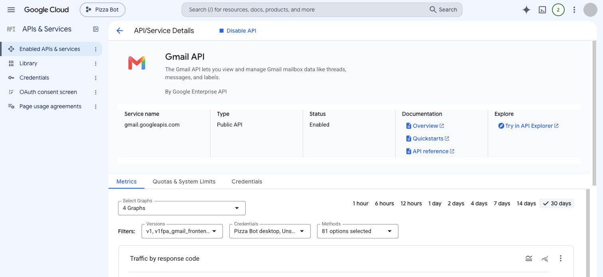

Repeat for the Calendar API:
`https://console.cloud.google.com/apis/library/calendar-json.googleapis.com?project=<PROJECT_ID>`

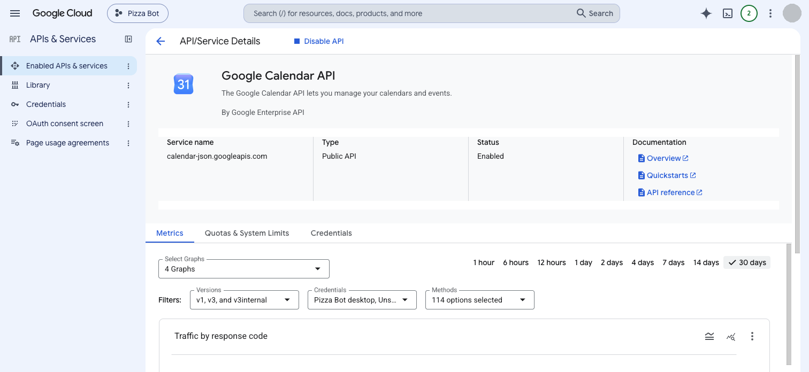

---

## 3. Configure the consent screen

Google calls this the **Google Auth Platform**. Open
`https://console.cloud.google.com/auth/overview/create?project=<PROJECT_ID>`.

### Step 1: App information

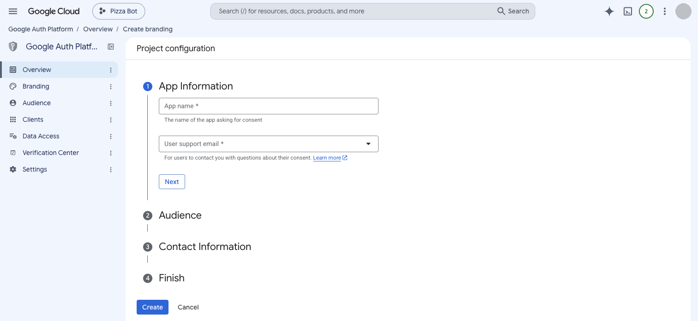

Enter the app name (**Pizza Bot**) and pick your own address as the user support email.

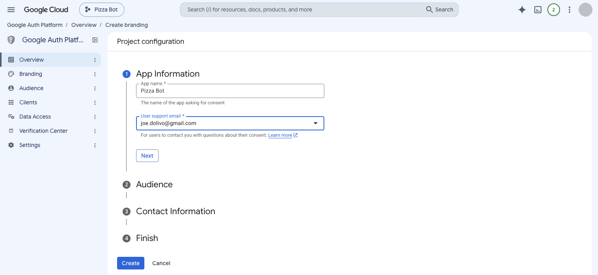

### Step 2: Audience

Choose **External**. **Internal** only works inside a Google Workspace organization, and a personal Gmail account has none.

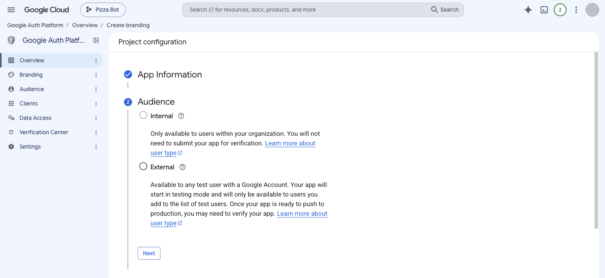

### Step 3: Contact information

Enter the address where Google may email you about the project.

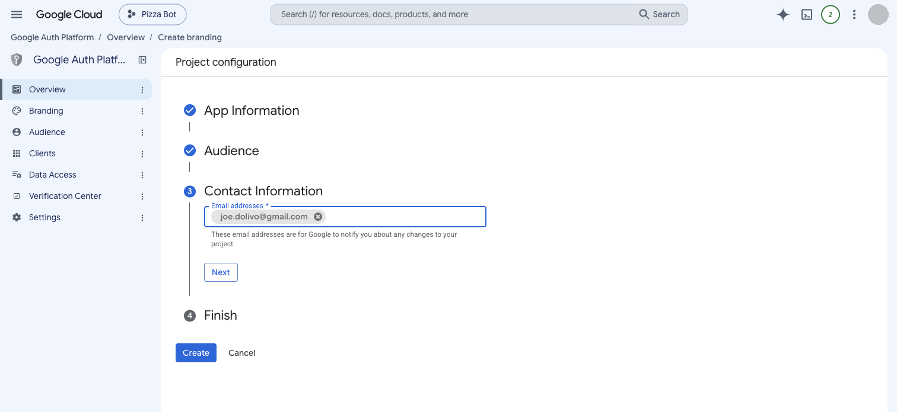

### Step 4: Finish

Tick **I agree to the Google API Services: User Data Policy**, click **Continue**, then **Create**. This is a policy agreement made in your name, so read it first.

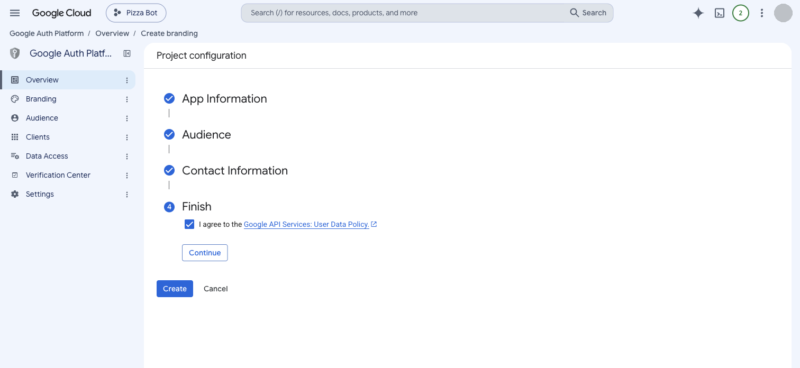

When it succeeds you land on the OAuth Overview with the message "OAuth configuration created!".

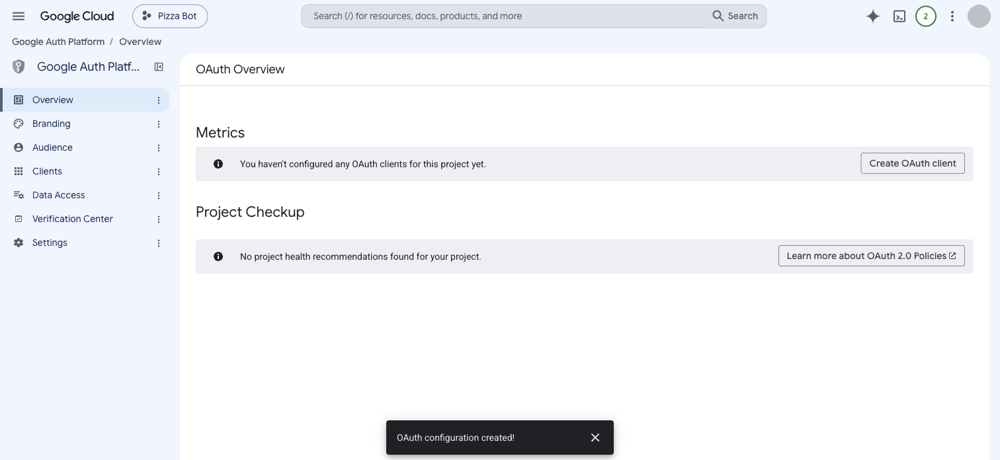

---

## 4. Declare the scopes (Data Access)

Open `https://console.cloud.google.com/auth/scopes?project=<PROJECT_ID>` and click **Add or remove scopes**.

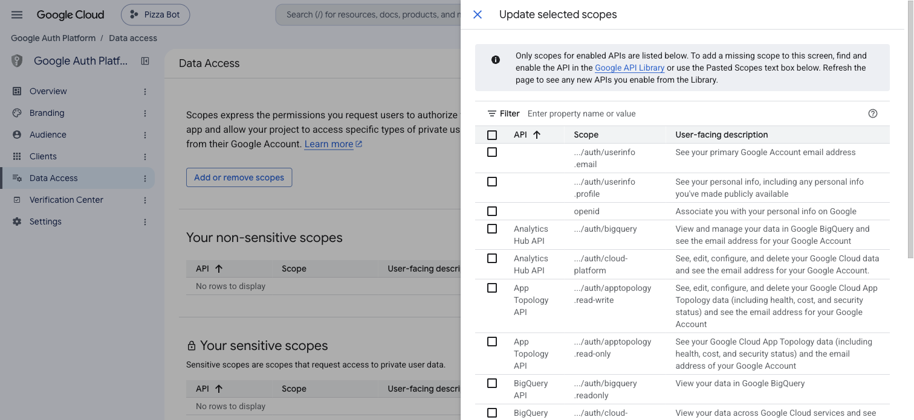

Scroll to **Manually add scopes**, paste the four scopes below, click **Add to table**, then **Update**.

```
https://www.googleapis.com/auth/gmail.readonly
https://www.googleapis.com/auth/gmail.compose
https://www.googleapis.com/auth/calendar.readonly
https://www.googleapis.com/auth/calendar.events
```

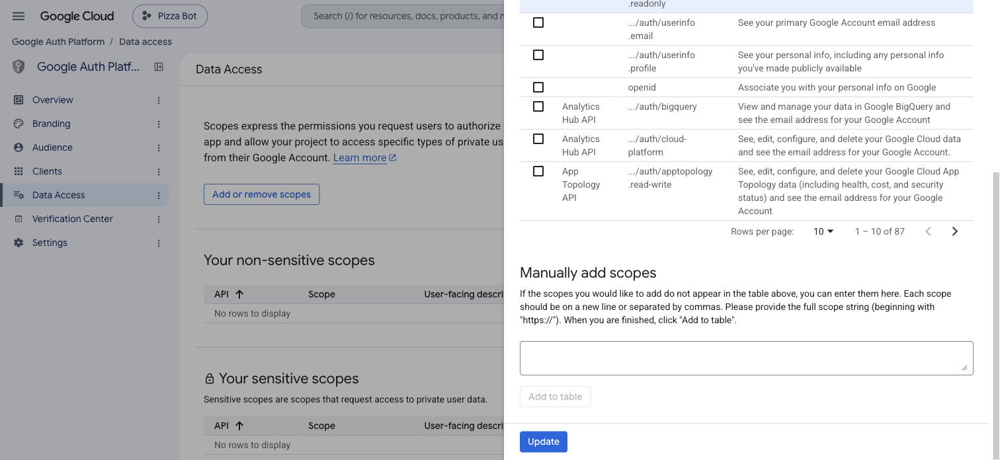

Click **Save** on the Data Access page. You should see "Data access changes saved!", and the scopes appear under the sensitive and restricted tables.

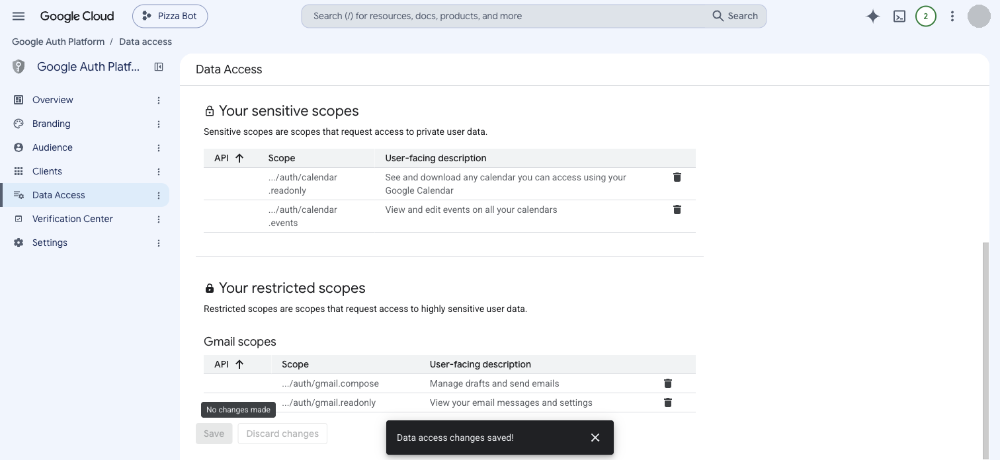

| Scope | Why the plugin needs it |
|---|---|
| `gmail.readonly` | Search and read threads and labels |
| `gmail.compose` | Create drafts. **Google describes this scope as "Manage drafts and send emails", so it also permits sending.** The plugin never sends, but the token could. |
| `calendar.readonly` | List calendars and events, and find free time |
| `calendar.events` | Create events |

To withhold the send-capable scope and write access, pass `--read-only` when you run the consent flow in step 6.

---

## 5. Add yourself as a test user

New External apps start in **Testing** mode, where only listed test users can authorize them. Open `https://console.cloud.google.com/auth/audience?project=<PROJECT_ID>`.

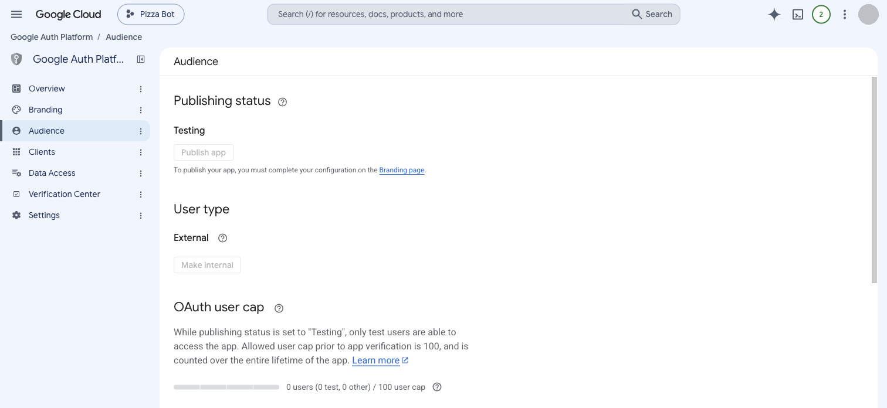

Under **Test users**, click **Add users**, enter your Google account, and click **Save**.

The user cap should now read "1 user (1 test, 0 other)".


> **Publishing to production is not available yet.** The **Publish app** button is disabled until the Branding page is complete. See [Avoiding the 7-day token expiry](#avoiding-the-7-day-token-expiry).

---

## 6. Create a Desktop OAuth client

Open `https://console.cloud.google.com/auth/clients/create?project=<PROJECT_ID>`.

- **Application type:** Desktop app
- **Name:** anything, for example *Pizza Bot desktop*
- **This client will be used by an AI-powered agent:** tick this. Google describes it as designating the client "for AI agents that take actions on behalf of users", which is what Pizza Bot is.

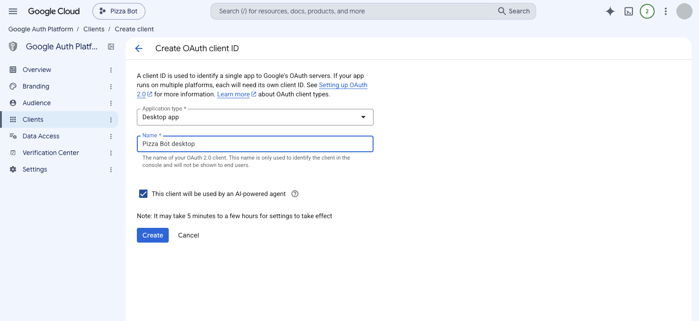

Click **Create**. A dialog shows the client ID and **client secret**. Click **Download JSON**.

> **Do not screenshot, paste, or commit this dialog or the JSON.** The client secret is a credential. This guide deliberately has no image of it.

---

## 7. Run the consent flow

From the repository root, with the downloaded JSON:

```bash
npm run auth -w @pizza-bot/plugin-google-workspace -- --client-file ~/Downloads/client_secret_<...>.json
```

The command starts a loopback listener on `127.0.0.1`, prints an authorization URL, and tries to open it in your default browser. It uses PKCE and checks the `state` value on the way back.

Useful flags:

| Flag | Effect |
|---|---|
| `--read-only` | Request only `gmail.readonly` and `calendar.readonly` |
| `--logout` | Delete the stored credentials from the keychain |

In the browser:

1. **Choose your account.**

   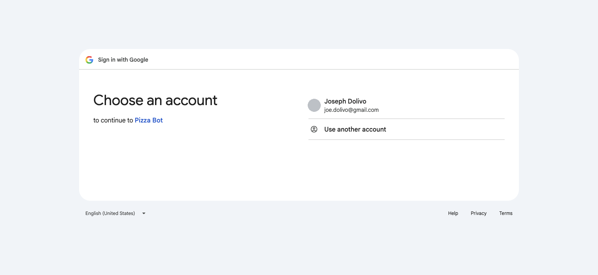

2. **Continue past the unverified-app notice.** This is expected, because the app is yours and is in Testing mode.

   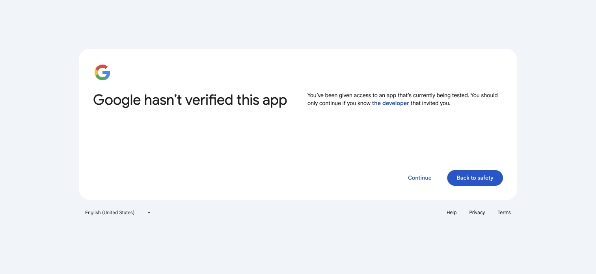

3. **Review the permissions.** Google shows each scope as its own checkbox, and all of them start unticked.

   

4. **Tick every scope (or Select all) and click Continue.** If you leave one unticked, the matching tools fail with an "insufficient scope" error.

   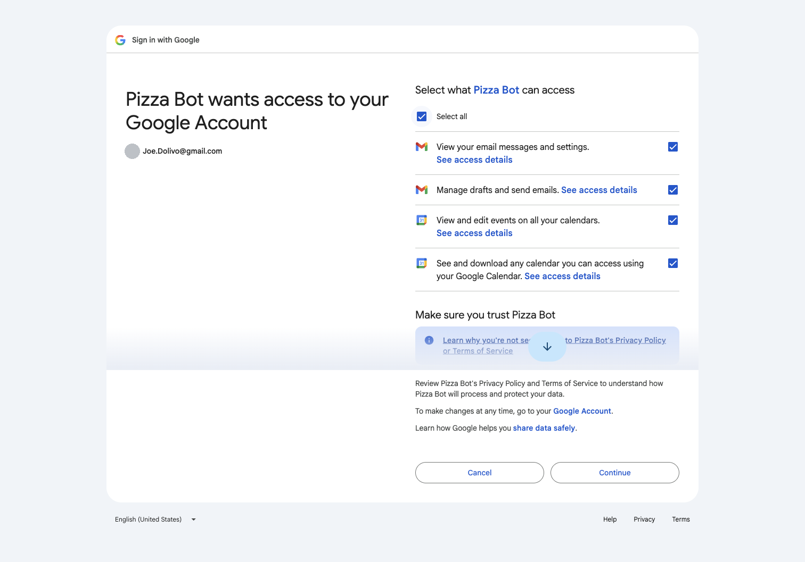

5. Google redirects to the local listener, which shows a confirmation.

   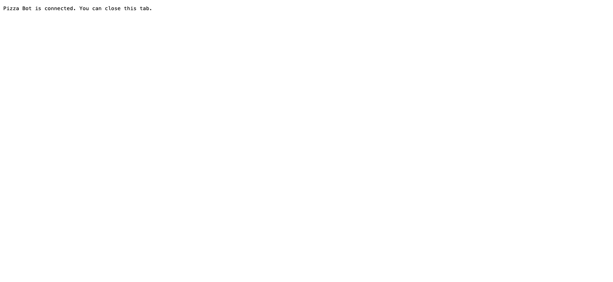

The terminal prints `Stored credentials in the OS keychain (4 scopes).` The client ID, client secret, and refresh token are stored together as one entry under the service name `pizza-bot-google-workspace`.

**Then delete the downloaded JSON.** It is no longer needed, because the same values are in the keychain.

---

## 8. Reconnect and verify

In Pizza Bot, open the **Plugins** page and reconnect the `google-workspace` server. It should report 9 tools, and the `email` and `calendar` skills should appear.

To check the plugin directly, outside Pizza Bot, call each tool through the MCP server. Against a real account, the author got:

| Tool | Result |
|---|---|
| `list_labels` | 25 labels |
| `list_calendars` | 6 calendars |
| `list_events` (next 48 h) | 4 events |
| `find_free_time` | 3 slots |
| `search_threads` | 3 threads |
| `get_thread` | 1 message |

Try these in Pizza Bot:

- "What's on my calendar tomorrow?"
- "When am I free for 30 minutes this week?"
- "Summarize unread mail from the last two days."
- "Draft a reply to the latest thread from Alex." The draft lands in Gmail Drafts and is never sent.

---

## Publish to production (avoid the 7-day expiry)

While the app is in **Testing**, Google expires the refresh token after 7 days and you must re-run step 7. Setting the publishing status to **In production** removes that limit. The **Publish app** button stays disabled until the Branding page is complete.

### Fill in the Branding page

Open `https://console.cloud.google.com/auth/branding?project=<PROJECT_ID>`. At minimum you need:

| Field | What to enter |
|---|---|
| Application home page | A public page on a domain you control, for example `https://pizza-bot.example.com` |
| Application privacy policy link | A privacy policy on that domain, for example `https://pizza-bot.example.com/privacy` |
| Authorized domain 1 | The root domain that contains those links, for example `example.com` |

An application terms-of-service link is optional. Click **Save**.

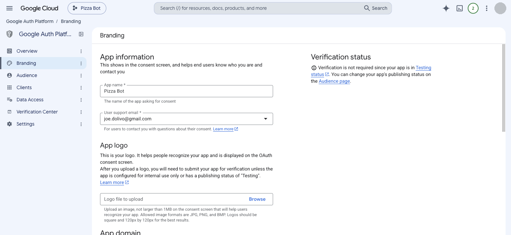

Google did not check that these URLs resolve when the app was published. Verification, if you ever request it, will check them, so put a real, public privacy policy at that address. For a local-only tool it can be short: what data is accessed, that it stays on the user's machine, and how to revoke access.

### Publish

On the **Audience** page click **Publish app**, then **Confirm** in the "Push to production?" dialog. The status changes to **In production**.

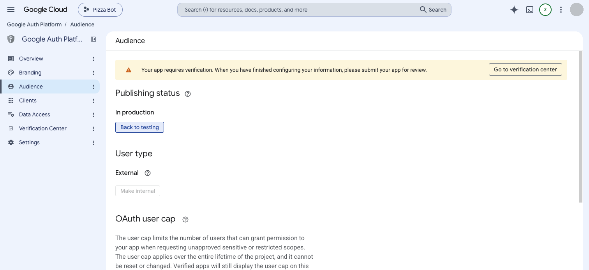

The banner saying the app requires verification is expected, because the app asks for sensitive and restricted scopes. You can switch back to Testing at any time with **Back to testing**.

### Re-issue the token

A refresh token issued while the app was in Testing keeps the Testing rules. Run the consent flow again so the token is issued under production:

```bash
npm run auth -w @pizza-bot/plugin-google-workspace
```

No client JSON is needed this time, because the command reuses the client already in the keychain. The screens differ slightly in production.

1. The unverified-app screen has an **Advanced** link instead of a Continue button.

   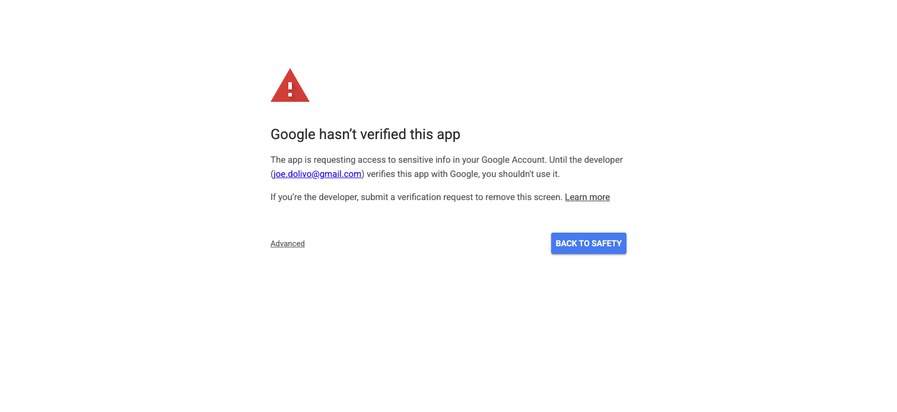

2. Click **Advanced**, then **Go to Pizza Bot (unsafe)**. Google names the developer here, so confirm it is you.

   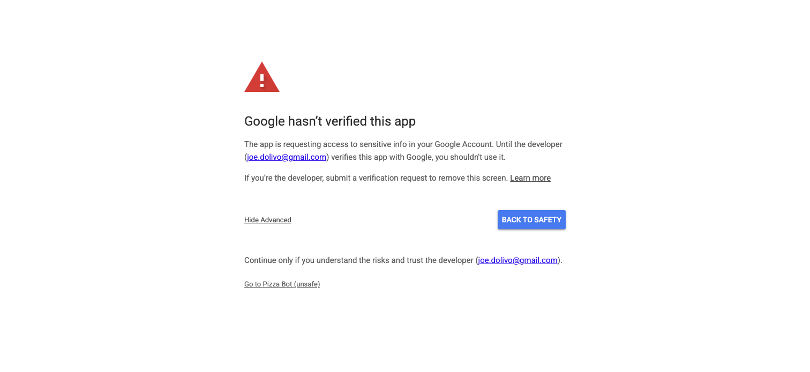

3. If the account already granted all four scopes, Google skips the checkboxes and shows "Pizza Bot already has some access". Click **Continue**.

Notes:

- A published app with sensitive or restricted scopes that is not Google-verified is capped at 100 users and shows the unverified screen. That is fine for personal use. Google also warns that some access "may be lost" until the app is verified, so keep an eye out for `invalid_grant` errors.
- Verification is a separate, optional process that involves a review.

---

## Test it in Pizza Bot

Run a throwaway instance so your real threads and settings stay untouched. Use a scratch data folder and different ports:

```bash
PORT=18080 PIZZA_DATA_ROOT=/tmp/pizza-scratch PIZZA_ALLOWED_ORIGINS=http://localhost:15173 \
  npx tsx apps/api-server/src/index.ts
# in a second terminal
cd apps/web && PIZZA_API_TARGET=http://localhost:18080 npx vite --port 15173 --strictPort
```

Open `http://localhost:15173`, configure a model provider under **Settings > Providers**, and check the api-server log for a line like `MCP server "google-workspace" → 9 tool(s)`.

Then try these prompts. Each should show a **Delegate to calendar** or **Delegate to email** step:

| Prompt | Expected |
|---|---|
| "What's on my calendar for the next two days? Also tell me roughly when I have a free 30-minute window." | `calendar` skill; an event list and free windows |
| "List just the sender and subject of my 3 most recent email threads. Don't quote any message bodies." | `email` skill; three senders and subjects |
| "Create a Gmail draft addressed to me with the subject 'Pizza Bot test draft'. Do not send it." | `email` skill; a draft ID. Check Gmail Drafts, and note the Sent folder stays empty. |

When finished, stop both servers and delete the scratch folder.

---

## Removing access

- Delete the stored credentials: `npm run auth -w @pizza-bot/plugin-google-workspace -- --logout`
- Revoke the grant on Google's side at <https://myaccount.google.com/permissions>.
- Delete the OAuth client or the whole project in the Cloud Console.

## Troubleshooting

| Symptom | Cause and fix |
|---|---|
| `No Google credentials in the OS keychain` | Run step 7. |
| `Google rejected the stored refresh token` | The token was revoked or expired (7 days in Testing). Re-run step 7. |
| `The granted Google scopes do not allow this action` | You left a scope unticked, or used `--read-only`. Re-run step 7 and tick every scope. |
| `Google returned no refresh token` | Google only issues one on first consent. Revoke the app at <https://myaccount.google.com/permissions> and retry. |
| "Access blocked" or "not eligible" on the consent screen | Your account is not in the Test users list (step 5). |
| `Google rejected the stored refresh token` soon after publishing | Re-issue the token with step 7 so it is created under production rules. |
| `OS keychain is unavailable` | The host has no usable keychain, as in a headless container. The plugin needs macOS Keychain, Windows Credential Manager, or libsecret. |
| New client rejected for a few minutes | Google notes that client changes can take from 5 minutes to a few hours to take effect. |
